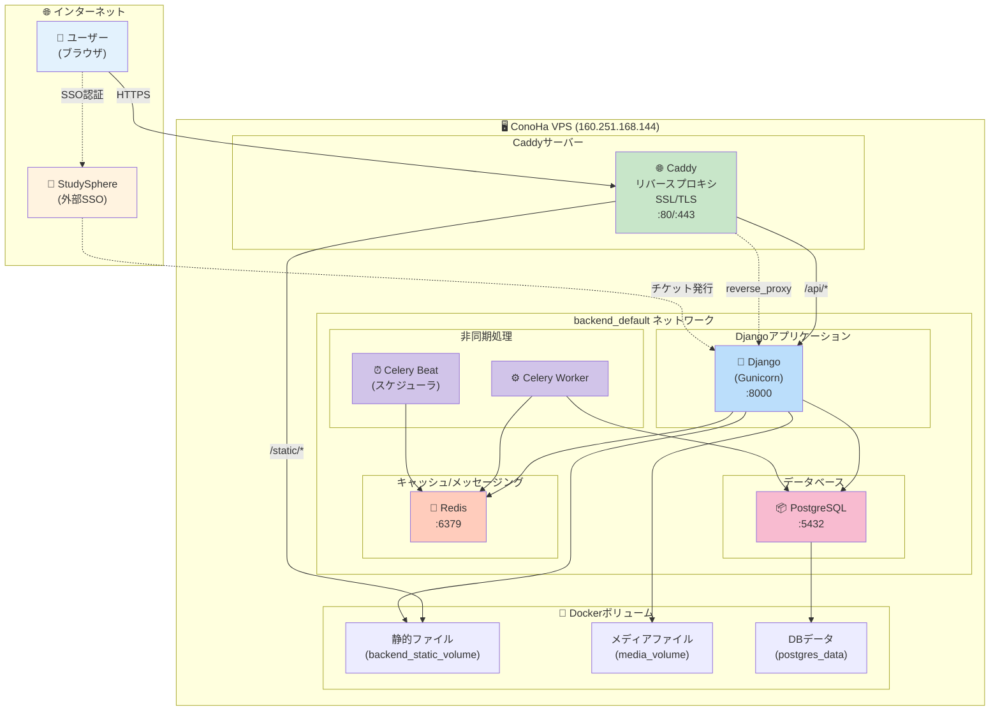
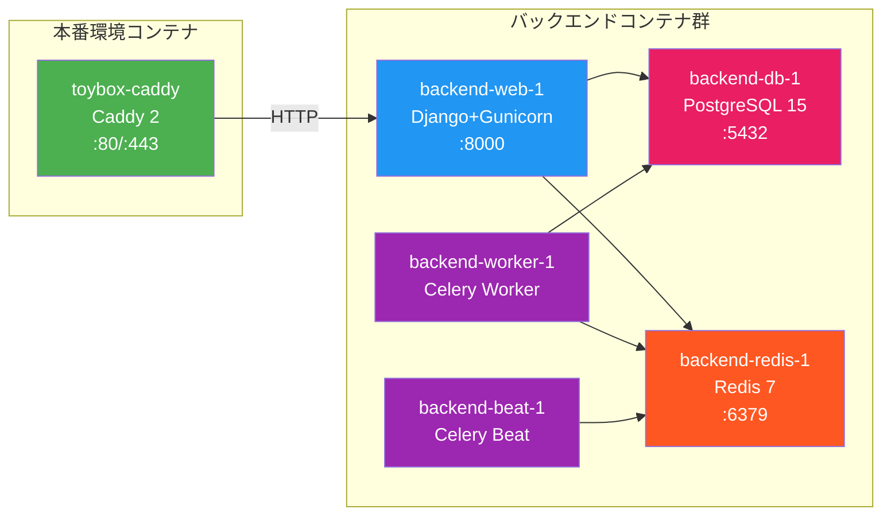
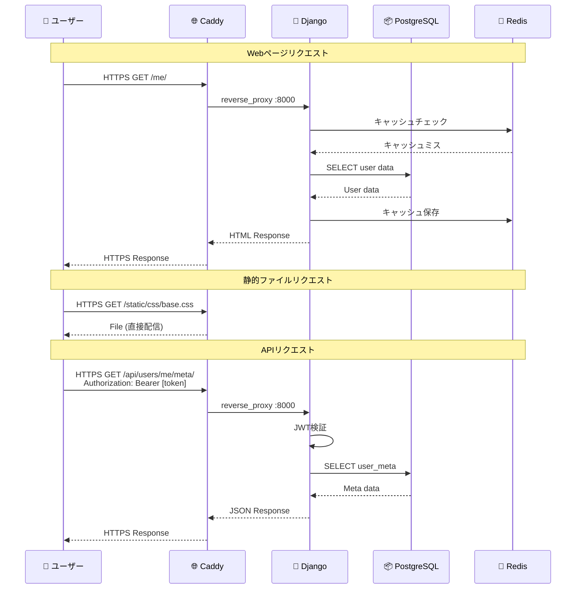
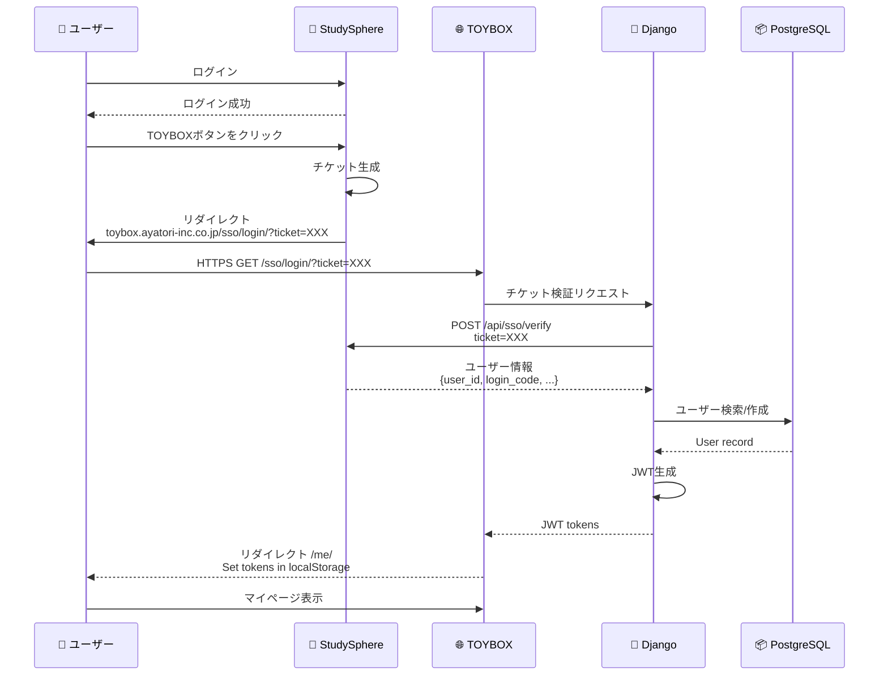
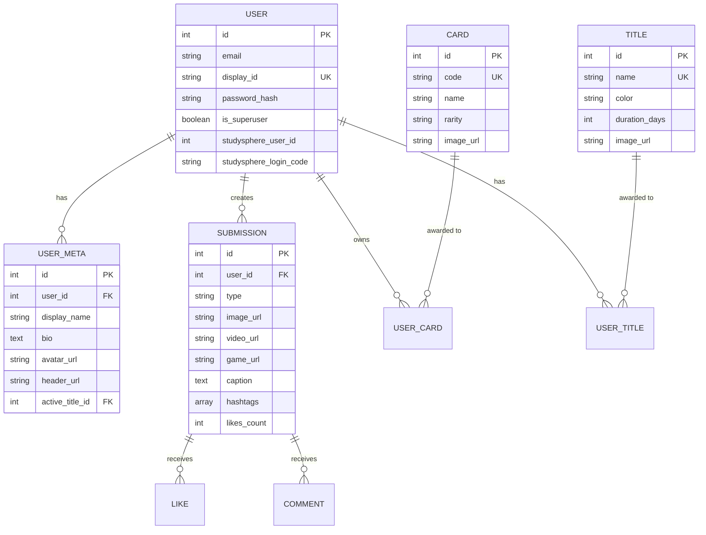
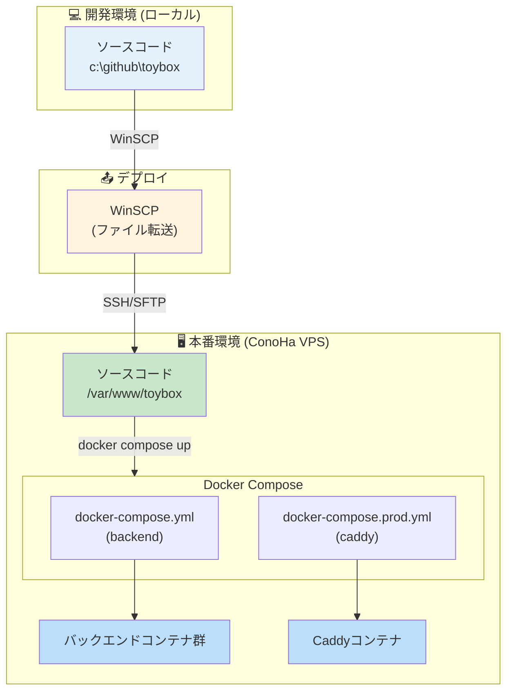

# TOYBOXシステム構成図 (Mermaid)

## システム全体構成図

---

## コンテナ構成図

---

## リクエストフロー図

---

## StudySphere SSO認証フロー

---

## データモデル概要

---

## デプロイメント構成

---

**作成日**: 2026年1月23日  
**TOYBOX開発チーム**

## 使用方法

このMermaid記法は以下のツールで図として表示できます：

1. **GitHub/GitLab**: README.mdにそのまま貼り付け
2. **Mermaid Live Editor**: https://mermaid.live/
3. **VS Code**: Mermaid拡張機能をインストール
4. **Notion**: `/code` でMermaidブロックを作成
5. **Confluence**: Mermaid for Confluenceプラグイン
